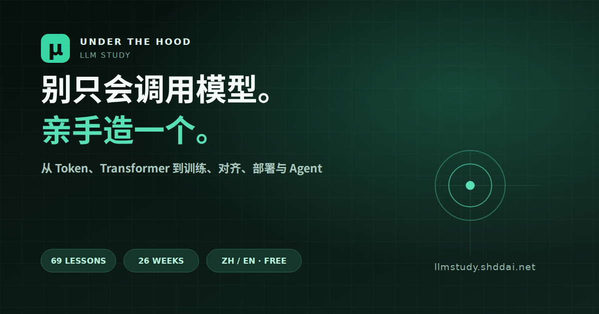

# UNDER THE HOOD · 大模型系统课

一个面向认真自学者的中英双语大模型学习网站。课程以“能解释、能实现、能诊断、能迁移”为掌握标准，沿着 26 周路线从数学与自动微分走到 GPT、训练系统、后训练、推理部署与 Agent。

在线访问：[llmstudy.shddai.net](https://llmstudy.shddai.net)

[](https://llmstudy.shddai.net/zh/?utm_source=github&utm_medium=referral&utm_campaign=organic_launch&utm_content=readme_cover)

无需登录即可学习，进度先保存在本机；登录后可跨设备同步。可以先从这三节试看：

- [反向传播为什么需要逆拓扑与梯度累加](https://llmstudy.shddai.net/zh/lesson/1-3-make-gradients-flow-backward-through-a-graph/?utm_source=github&utm_medium=referral&utm_campaign=organic_launch&utm_content=readme_backprop)
- [Q、K、V 与缩放点积注意力](https://llmstudy.shddai.net/zh/lesson/3-2-scaled-dot-product-attention/?utm_source=github&utm_medium=referral&utm_campaign=organic_launch&utm_content=readme_attention)
- [一个可控的 AI Agent 最小闭环](https://llmstudy.shddai.net/zh/lesson/7-1-the-minimal-agent-loop/?utm_source=github&utm_medium=referral&utm_campaign=organic_launch&utm_content=readme_agent)

适合希望从“会调用 API”继续走到“能解释、能实现、能诊断”的学习者。若课程结构、事实或来源有问题，欢迎提交 Issue；具体、可复现的纠错比单纯 Star 更有价值。

## 当前版本

- 8 个阶段、69 节深度课、24 类核心实验、8 个阶段作品
- 中 / EN 整站切换：导航、69 节课程数据、学习页、实验、项目、资料库与账户流程均支持双语
- 51 节课程配有视频研讨：国内模式全部使用 B站；国际模式使用 YouTube 或官方课程、论文、代码仓库，不再回落到 B站
- 长课程精确映射到对应分P；无法合法嵌入的国际材料明确展示官方原始入口
- 69 节课程均可进入完整学习页：目标、直觉、机制、实践、自测、笔记与掌握门
- 深度反向传播工作台：理论阅读、公式、代码、计算图和反思题
- Dark / Light 模式一键切换并持久化偏好
- 游客模式本地保存学习笔记与完成状态，登录不阻断学习
- 邮箱注册、登录、退出与密码找回；首次登录自动导入本机进度
- Supabase 云端同步课程完成状态、笔记、主题、网络模式和最近学习位置
- 本地优先同步：离线时继续学习，网络恢复后安全合并；支持多设备进度一致
- 推理章节加入 DSpark 投机解码论文桥与硬件感知调度视角
- 大师资料库：Karpathy、Stanford CS336、PyTorch、Hugging Face、FSDL、Megatron-LM、llama.cpp、vLLM、Transformer Circuits 等
- 视频来源分为官方双语、中文原创、源码带读和社区字幕；社区镜像同时保留原始课程链接
- 可用交互：全站搜索、课程切换、资源筛选、代码运行状态、进度操作和移动端导航
- 自适应桌面与手机，中英文字体随站点打包

## 本地运行

```bash
npm install
npm run dev
```

复制 `.env.example` 为 `.env.local`，填写 Supabase 项目地址和 publishable key，即可启用账号同步：

```bash
VITE_SUPABASE_URL=https://your-project.supabase.co
VITE_SUPABASE_PUBLISHABLE_KEY=sb_publishable_your_key
```

数据库结构与 RLS 策略位于 `supabase/migrations/`。匿名角色无权读取学习数据；登录用户只能访问 `auth.uid()` 对应的个人记录。Service Role Key 不进入浏览器，也不应写入任何 `VITE_` 环境变量。

生产构建：

```bash
npm run build
npm run preview
```

## 课程设计原则

1. **第一性原理优先**：先在 50–200 行最小实现里看见机制，再进入成熟框架。
2. **理论与实践成对出现**：公式必须映射到代码、shape、实验和故障。
3. **三类证据验收**：能讲清、能闭卷实现、能在新约束下迁移。
4. **阶段作品可公开**：README、测试、实验日志、失败复盘和演示缺一不可。
5. **一手资料主导**：课程官方页、作者本人内容、论文和项目官方文档优先。

## 主要资料主线

- [Andrej Karpathy · Neural Networks: Zero to Hero](https://karpathy.ai/zero-to-hero.html)
- [Andrej Karpathy · micrograd](https://github.com/karpathy/micrograd)
- [Andrej Karpathy · nanoGPT](https://github.com/karpathy/nanoGPT)
- [Andrej Karpathy · llm.c](https://github.com/karpathy/llm.c)
- [Andrej Karpathy · nanochat](https://github.com/karpathy/nanochat)
- [Stanford CS336 · Language Modeling from Scratch](https://cs336.stanford.edu/)
- [Hugging Face · LLM Course](https://huggingface.co/learn/llm-course/chapter1/1)
- [Full Stack Deep Learning · LLM Bootcamp](https://fullstackdeeplearning.com/llm-bootcamp/)

## 视觉方向

“研究笔记 × 工程控制台”。借鉴 `taste-skill` 的 anti-slop 原则：单一强调色、非居中首屏、少卡片多轨道与分隔线、统一圆角、克制动效、避免 AI 紫色渐变与模板式三卡布局。界面为原创实现，没有复制 `taste-skill` 的代码或成品页面。

## 技术栈

React 19、Vite 7、Supabase Auth + Postgres、Phosphor Icons、原生 CSS。网站部署于 Vercel；学习状态采用 localStorage 本地优先、Supabase 登录后增量同步的双层模型。Supabase 客户端按需加载，不阻塞游客首屏。

## 内容与版权

站内讲解、练习和界面为原创组织与表达；外部课程、论文、博客和开源项目均在资料库中标注来源。仓库不包含学习者上传的书籍或论文 PDF，也不复制受版权保护的正文。
